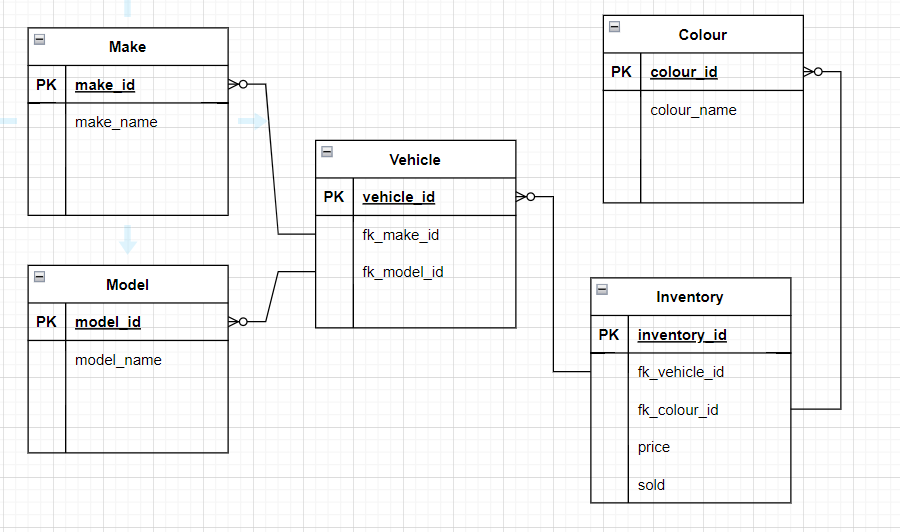

# VehiclesAPI
Small RESTful API written in Express connecting to postgres db  
Database Design:
  
Uses:
<ul>
<li>Jest to test basic endpoints </li>
<li>SQL then Sequelize to connect to PostgreSQL </li>
</ul>
